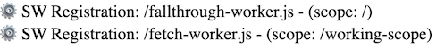
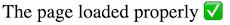

# chrome-service-worker-bug
Demonstration of a service worker bug in Chrome 104 and earlier releases

## To run

1. npm i
2. npm start
3. navigate to http://localhost:8081

## To test
1. The links will describe the test condition.
2. Each page will list the registered service workers with a ⚙️ next to registered scope and service worker script.

3. Each page has some JS that appends a `
` tag with a ✅ emoji when the dom has finished loading. If the page comes up blank, you're experiencing the bug.

